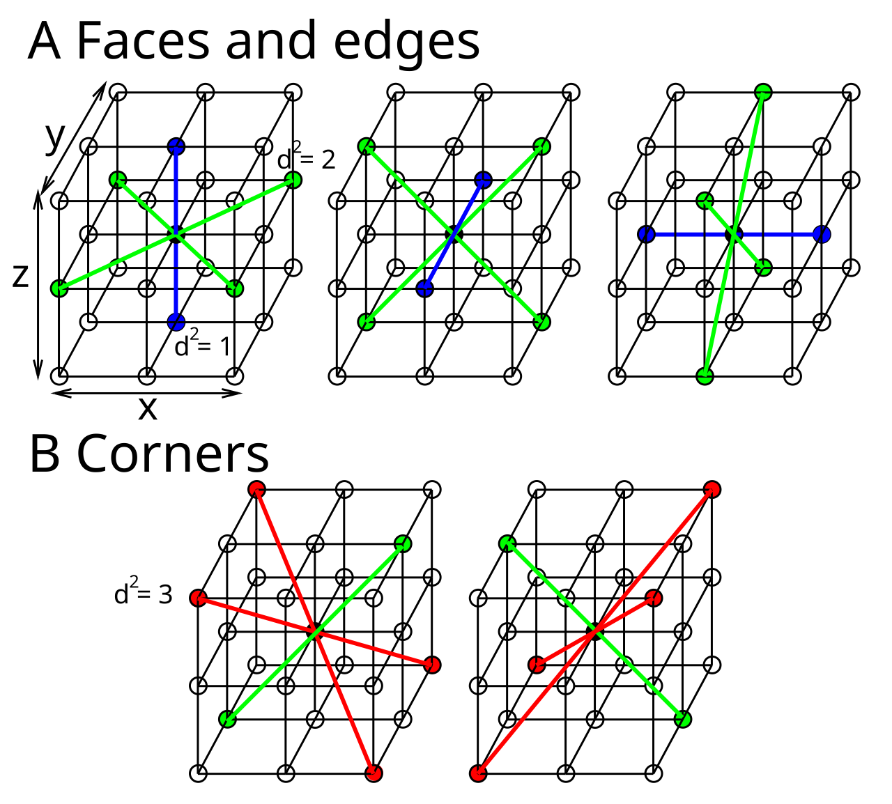

+++
Categories = ["Spinfield Model"]
bibfile = "mechphys.json"
+++

{id="figure_ca2d" style="height:20em"}

{id="figure_cubes" style="height:40em"}

The computational modeling approach here is essentially a complex version of a **cellular automaton (CA)**, which has been investigated as a basis for fundamental physics modeling since the 1950s. A CA consists of a regular, uniform division of space into discrete _cells_, each of which has one or more _state_ values, and each cell interacts only with its nearest neighbors (i.e., locally) to update its state value over time ([[#figure_ca2d]]; [[#figure_cubes]]).

Such a system was first described by Stanislaw Ulam in 1950, and has been popularized in its two-dimensional form in "the game of Life" by John Conway (described by [[@Gardner70]]). As anyone who has seen this system in operation knows, it is capable of producing remarkable complexity from such simple, local, deterministic rules.

In this CA (widely available as a screensaver), there is a two-dimensional grid of square cells, with each cell having a single binary state value (0 = "dead" and 1 = "alive"). This state value updates in discrete, simultaneous steps as a function of the state values in the 8 neighbors of each cell:

* If the sum of the neighbors' states is > 3 or < 2, then the cell is dead (0) on the next time step (from "overcrowding" or "loneliness", respectively).

* If it has exactly 3 live neighbors and is currently dead, then it is "born" and goes to 1.

* If it was already "alive" then it remains so, only if it has 2-3 living neighbors.

The CA framework provides the simplest kinds of answers to fundamental questions about space, time, and the basic nature of physical laws ([[@VonNeumannBurks66]]; [[@Zuse70]]; [[@FredkinToffoli82]]; [[@Feynman82]]; [[@Fredkin90]]; [[@Hooft15]]). Space is _real_ and fundamental in the form of the underlying cells --- it isn't just an empty vacuum or a mathematical continuum.

The discretization of space, as contrasted with a true continuum, can be motivated by the levels of infinities associated with the Cantor sets: a discrete space corresponds to the lowest level of infinity associated with the integer number line, and thus represents the simplest way of representing space.

One still has an infinity to deal with, and this is plenty mind-blowing all by itself: space and time continuing infinitely in all directions, forever. But at least the further difficulty of an infinity of space or time _within_ any given segment, which is required for a truly continuous dimension, can be avoided. One could reasonably argue that the infinity of space and time is more plausible than the notion of an edge, as in the old flat Earth models and the end of the world.

The physical phenomenon of discrete point-like elementary particles also suggests the need for an **ultraviolet cutoff** at some distance scale: infinitely small point-like particles predict infinite field amplitudes in their immediate neighborhood. Instead, a discrete lattice with a given grid spacing distance provides a tractable, non-divergent mechanism for such discrete particles, as discussed in the [[spinfield]] model.

Time emerges naturally in its unique unidirectionality within the CA framework, simply as a discrete rate of change in the state values. Furthermore, the ratio of discrete spatial cell width to discrete rate of state update provides a natural upper limit to the rate at which anything can propagate within this system: i.e., the **speed of light** in a vacuum. Thus, this principal postulate of special relativity that light has a fixed upper speed limit emerges as a necessary consequence of more fundamental assumptions about the nature of space and time in the CA framework. 

Furthermore, the basic [[wave]] equation can be computed using a simple local neighborhood interaction among cells in a CA-like system, and [[Maxwell]]'s equations for the electromagnetic field and [[Dirac]]'s equation for the quantum wave function of an electron can be computed using primarily this basic wave equation. This framework predicts all of the strange properties of [[special relativity]] in a principled manner based on the discretization of space and time, together with wave dynamics. 

Note that these wave-based equations do require real-valued state variables, which is a departure from the simplest form of CA that only employs simple discrete state values. The continuously varying nature of electromagnetic radiation (EM) (i.e., light) provides strong evidence that the states of nature do have this continuous-valued nature. In addition, we require a stochastic process to randomly choose the next location for a discrete particle to move (see [[stochastic motion]]). 

Ultimately, the model needs to _work_ to explain the available data, and our intuitions about "mechanistic" level plausibility are secondary concerns: if these intuitions align with reality in a way that makes everything work, it is obviously great, but you cannot let them stand in the way of making progress.

To summarize, here are the critical constraints imposed by the CA framework that we adopt:

* Space and time are discrete.

* State can be continuous-valued.

* State is updated discretely at each time step, in _parallel_ across all cells, using only _locally available_ information within each cell and from its 26 neighbors in 3D space.

This parallel and local nature of the state update imposes strong constraints on the nature of the available mechanisms, in ways that end up aligning with known physical properties.

## Physical implications

One specific implication of the CA framework is that it unambiguously establishes the position basis as primary for representing discrete massive particles, consistent with the [[pilot-wave]] framework. In addition, the [[Pauli exclusion principle]] is strongly suggestive of a discrete CA-like state. This principle posits that only one _fermion_ (electron, quark, etc, with a quantum spin of 1/2) can occupy the same quantum state, including position, at a time.

Thus, the underlying CA state representation only needs to be able to hold one of each particle type, which eliminates the difficult problem of having to represent a variable number of such particles at each location. In other words, the "memory allocation" for each cell is constant.

This exclusion principle does not apply to _boson_ particles, and would thus require an indefinite number of memory slots to represent (along with all the other difficulties involved in the particle picture for force fields). Thus, the CA framework, along with a number of other considerations, strongly supports the [[semiclassical]] picture, where quantum particles interact with a classical purely wave-based EM state propagating according to [[Maxwell]]'s equations.

The notion of _autonomy_ in a CA is also particularly important as a physical model: the CA is entirely self-contained and can just plug away forever, running the same exact local laws every time step. By contrast, most calculational tools used in physics require a specific setup and different computational steps depending on exactly what situation is being modeled: they are far from "autonomous" in the sense of a CA.

When you look at the examples of plausible physical models ([[tools vs models]]), they all have this same autonomous character: e.g., general relativity and Maxwell's equations in the Lorenz gauge can just be configured with a starting state and then everything can evolve autonomously from there.

In summary, the CA framework is simple, elegant, and consistent with the most basic facts of physics. If one could develop a viable physical theory within the general confines of this framework, it would provide a uniquely simple and satisfying model of how nature works.

However, two important objections are typically raised about such a framework: isn't it just like the [[aether]] that was so famously rejected by the Michelson-Morley experiment; and if it has purely local interactions, how could it possibly account for the apparent [[non-locality]] of QM? See those pages for further discussion.

