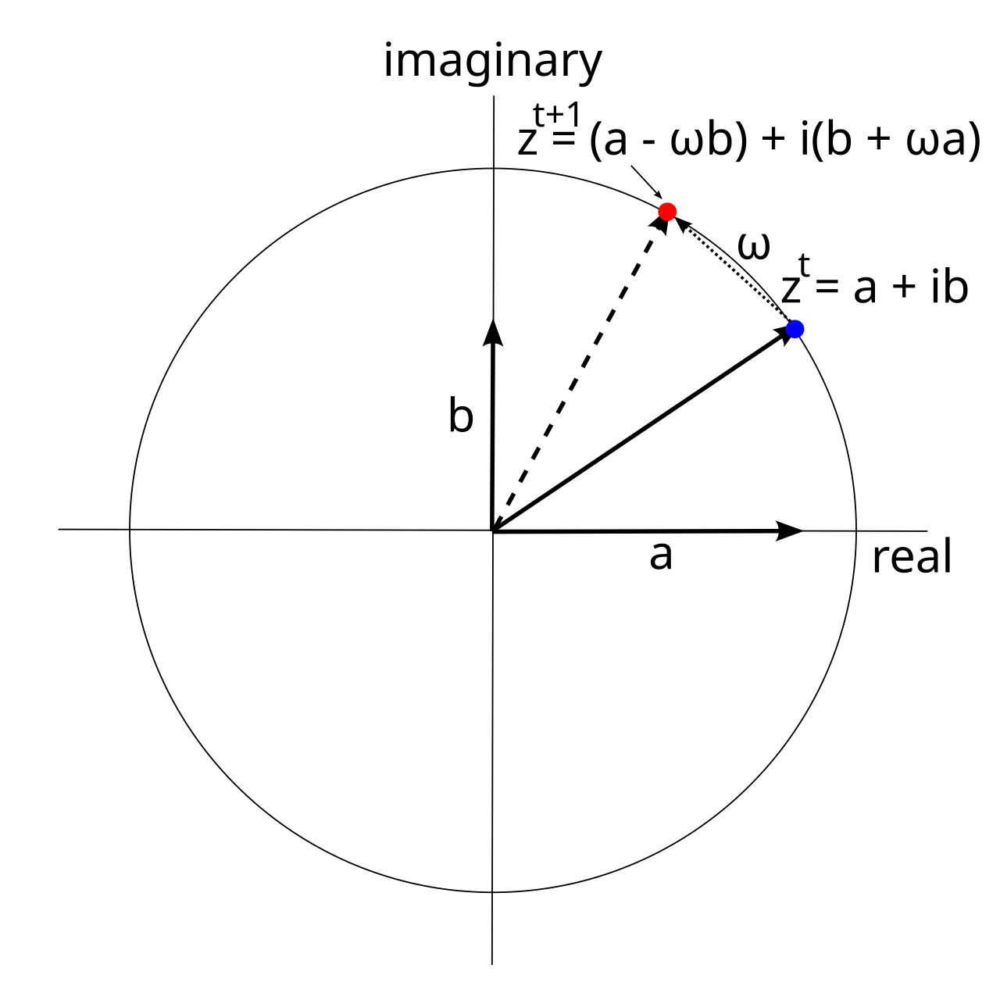

+++
Categories = ["Standard Model"]
bibfile = "mechphys.json"
+++

The **simple harmonic oscillator** (SHO) captures the core oscillatory behavior of [[wave]]s, without any spatial dimensions to bother with. It can be seen as the 0-dimensional version of a wave, where the force that drives the oscillation comes not from neighbors, but from the position (height) of the wave itself.

As such, it provides a potentially interesting role in the mechanics of [[stochastic motion]] because it can be entirely localized to one discrete grid cell within the [[cellular automaton]] framework. Thus, a particle in this view can be considered to be a simple harmonic oscillator that periodically jumps between cells. 

This discrete jumping creates many potential issues in interaction with a radiative wave field, which is solved in the [[spinfield]] model by propagating the discrete particle properties to surrounding locations. The version with [[#complex numbers]] developed below is more robust and appropriate for this framework for a number of reasons, but we start with the second-order SHO which is consistent with the second-order [[wave]] equations, and provides a clear macroscopic physical model.

{id="figure_sho" style="height:20em"}
](media/fig_harmonic_oscillator_mass_spring.png)

As is intuitively clear from the mass-on-a-spring physical model of a SHO ([[#figure_sho]]), the restoring force is directly proportional to the height of the weight:

{id="eq_force" title="restoring force"}
$$
f = -c^2 y^t
$$

where $c$ is the basic rate update constant, analogous to the speed of light in waves, which determines the effective strength of the restoring force, and thus the oscillation rate. The _t_ suffix indicates the time step (only for variables that require integration over time). Everything else from this point onward is the same as for the wave equations, in the basic Newtonian physics framework of acceleration, velocity, and position:

{id="eq_a" title="acceleration"}
$$
a = \frac{f}{m}
$$

{id="eq_" title="new velocity"}
$$
v^{t+1} = v^t + a
$$

{id="eq_" title="new state"}
$$
y^{t+1} = y^t + v^{t+1}
$$

The equivalent of the wavelength for the SHO is the _period_, in time, for the cycle to repeat, which is a function of the constants, via the **angular frequency** factor _omega_ ($\omega$):

{id="eq_omega" title="angular frequency"}
$$
\omega = \frac{c}{\sqrt{m}} = 2 \pi f
$$

so the frequency _f_ is:

{id="eq_freq" title="frequency"}
$$
f = \frac{\omega}{2 \pi} = \frac{c}{2 \pi \sqrt{m}}
$$

and the wavelength is the inverse of the frequency:

{id="eq_lambda" title="wavelength"}
$$
\lambda = \frac{1}{f} = \frac{2 \pi \sqrt{m}}{c}
$$

As with the wave equation, the kinetic and potential energy of the system are defined as follows:

{id="eq_kinetic" title="kinetic energy"}
$$
E_k = \frac{1}{2} m v^2 = \frac{1}{2 c^2} v^2
$$

{id="eq_potential" title="potential energy"}
$$
E_p = \frac{1}{2} \left( \left( y^t \right)^2 \right)
$$

The following simulation shows the behavior of this harmonic oscillator.

{id="sim_sho" title="Simple harmonic oscillator" collapsed="true"}
```Goal
ip := 1.0
c := 0.2
mass := 0.5
csq := c * c
lambda := (2 * math.Pi * math.Sqrt(mass)) / c
freq := 1.0 / lambda

var massStr, cStr, ipStr, msgStr string

##
totalTime := 100
sp := zeros(totalTime)
sv := zeros(totalTime)
pE := zeros(totalTime)
kE := zeros(totalTime)
tE := zeros(totalTime)
##

func valUpdate() {
    massStr = fmt.Sprintf("mass: %4.1f", mass)
    cStr = fmt.Sprintf("c: %4.1f", c)
    ipStr = fmt.Sprintf("start: %4.1f", ip)
    csq = c * c
    lambda = (2 * math.Pi * math.Sqrt(mass)) / c
    freq = 1.0 / lambda
    ##
    mf := array(mass)
    cf := array(csq)
    p := array(ip)
    pp := array(ip)
    pv := array(0.0)
    mv := array(0.0)
    v := array(0.0)
    pot := array(0.0)
    kin := array(0,0)
    ##
    for t := range 100 {
        ##
        pv = 1.0 * v  // if no 1.0 * then does direct assignment :(
        pp = 1.0 * p
        v = pv - (cf * pp) / mf
        p = pp + v
        
        mv = 0.5 * (v + pv) // midway
        pot = 0.5 * pp * pp
        kin = (mv * mv * mf) / (2.0 * cf)
        
        sp[t] = pp
        sv[t] = pv
        pE[t] = pot
        kE[t] = kin
        tE[t] = pot + kin
        ##
    }
    msgStr = fmt.Sprintf("<b>Total E: %7.3g λ: %7.3g f %7.3g </b>", tE.Float(99), lambda, freq)
}

valUpdate()

plotStyler := func(s *plot.Style) {
    s.Plot.XAxis.Label = "Time"
    s.Plot.XAxis.Range.SetMax(100).SetMin(0)
}
plot.SetStyler(sp, plotStyler) 

fig1, pw := lab.NewPlotWidget(b)
pl := plots.NewLine(fig1, sp)
vl := plots.NewLine(fig1, sv)
pEl := plots.NewLine(fig1, pE)
kEl := plots.NewLine(fig1, kE)
tEl := plots.NewLine(fig1, tE)
fig1.Legend.Add("p", pl)
fig1.Legend.Add("v", vl)
fig1.Legend.Add("pE", pEl)
fig1.Legend.Add("kE", kEl)
fig1.Legend.Add("tE", tEl)

msgTx := core.NewText(b)
msgTx.Styler(func(s *styles.Style) {
    s.Min.X.Ch(80) // clean rendering with variable width content
})
core.Bind(&msgStr, msgTx)

func updt() {
    valUpdate()
    pl.SetData(sp)
    vl.SetData(sv)
    pEl.SetData(pE)
    kEl.SetData(kE)
    tEl.SetData(tE)
    msgTx.UpdateRender()
    pw.NeedsRender()
}

func addSlider(label *string, val *float64, mnVal, mxVal float32) {
    tx := core.NewText(b)
    tx.Styler(func(s *styles.Style) {
        s.Min.X.Ch(40)  // clean rendering with variable width content
    })
    core.Bind(label, tx)
	sld := core.NewSlider(b).SetMin(mnVal).SetMax(mxVal).SetEnforceStep(true)
    if mxVal > 10 {
        sld.SetStep(10)
    } else {
        sld.SetStep(0.1)
    }
	sld.SendChangeOnInput()
	sld.OnChange(func(e events.Event) {
		updt()
		tx.UpdateRender()
	})
	core.Bind(val, sld)
}

addSlider(&massStr, &mass, 0.1, 1.0)
addSlider(&cStr, &c, 0.1, 1.0)
addSlider(&ipStr, &ip, 0.1, 2.0)
```

You can see that the overall behavior is independent of the amplitude (given by the starting position), but this amplitude does affect the energy.

## Damping

Damping in the SHO happens via a negative factor applied to the _velocity_ term:

{id="eq_damping" title="force with damping"}
$$
f = -c^2 y^t - r v^t
$$

where _r_ is a damping constant applied to the velocity $v^t$.

## Driving

Driving the SHO typically happens via a sine function added to the force. This need for a sine function introduces a significant implausibility for a fundamental physical process. For this reason, the version with complex numbers, described next, is more appropriate for the [[spinfield]] functionality, because it can be driven with a simple linear factor.

## Complex numbers

{id="figure_cvho" style="height:30em"}


As we can see in many other cases (e.g., the [[Schrodinger]] wave function vs [[Klein-Gordon]], and the 1st order vs 2nd order versions of the [[Dirac]] equation), the two elements of a [[complex number]] can be used to drive an oscillator, using a first-order equation instead of a second-order equation. This equation effectively just rotates a point around the complex plane, as shown in [[#figure_cvho]]. We refer to this as a _complex-valued harmonic oscillator_ (_CVHO_), which is different than a _complex harmonic oscillator_, which is a harmonic oscillator with more complex dynamics (e.g., damping, driving).

If you think of the real component as the position in the second-order SHO, then the imaginary component acts like the velocity, in being always 90 degrees out of phase. However, unlike the velocity, this imaginary component is of the same magnitude as the real component, and the two retain a hypotenuse (radius) of 1 as they rotate around the circle, which is what makes this system so simple and robust.

{id="eq_csho" title="complex-valued simple harmonic oscillator"}
$$
\frac{dz}{dt} = i \omega z
$$

where $z = a + ib$ is a complex number, and $\omega$ is the effective angular frequency, determining how quickly the two components _a_ and _b_ rotate into each other.

To drive this system, or to damp it, you simply increment or decrement the $\omega$ factor, and it will always respond appropriately.

Expanding [[#eq_csho]] with the complex number, and separating the terms into the real and imaginary parts, results in two simple update equations:

$$
\frac{d (a + ib)}{dt} = i \omega (a+ib)
$$

$$
\frac{da}{dt} + i \frac{db}{dt} = i \omega a - \omega b
$$

{id="eq_csho-ab" title="complex-valued simple harmonic oscillator, real equations"}
$$
\frac{da}{dt} = - \omega b
$$

$$
\frac{db}{dt} = \omega a
$$

Thus, each complex value rotates into the other in proportion to $\omega$, which we could compute from _c_ and _m_ parameters to replicate the behavior of the "physical" harmonic oscillator explored above.

As is the case for all the other first-order complex wave functions, if you perform a discrete stepwise integration of these two functions, using the current values of _a_ and _b_ to compute the next values, the result is numerically unstable. However, unlike the [[wave]] functions, this oscillator is entirely local to one [[cellular automaton]] (CA) cell, so it is possible to update the _a_ and _b_ values in sequential order, using the updated value for _a_ to compute _b_, or vice-versa. By contrast, the wave functions require integrating over neighbors, so it is not possible to get the current state values in a discrete-time parallel update CA model.

This subtle twist of numerical integration ultimately gives rise to the _CP violation_ that is otherwise so mysteriously present in the heart of fundamental physics. For example, the [[neutrino]] and its antimatter partner differ in the helicity of their [[spin]].

The following simple simulation shows the behavior of the complex-valued SHO, using the $\omega = \frac{c}{\sqrt{m}}$ parameters for angular frequency.

{id="sim_csho" title="Complex-valued simple harmonic oscillator" collapsed="true"}
```Goal
ip := 1.0
c := 0.2
mass := 0.5
csq := c * c
lambda := (2 * math.Pi * math.Sqrt(mass)) / c

var massStr, cStr, ipStr, msgStr string

##
totalTime := 100
sa := zeros(totalTime)
sb := zeros(totalTime)
##

func valUpdate() {
    massStr = fmt.Sprintf("mass: %4.1f", mass)
    cStr = fmt.Sprintf("c: %4.1f", c)
    ipStr = fmt.Sprintf("start: %4.1f", ip)
    lambda = (2 * math.Pi * math.Sqrt(mass)) / c
    ##
    omega := array(c) / sqrt(array(mass))
    aa := array(ip)
    bb := array(0.0)
    pa := array(ip)
    pb := array(0.0)
    ##
    for t := range 100 {
        ##
        pa = 1.0 * aa // if no 1.0 * then does direct assignment :(
        pb = 1.0 * bb
        aa = pa - omega * pb
        bb = pb + omega * aa // new aa
        
        sa[t] = pa
        sb[t] = pb
        ##
    }
    msgStr = fmt.Sprintf("<b>Total E: %7.3g ω: %7.3g λ: %7.3g </b>", tE.Float(99), omega.Float(0), lambda)
}

valUpdate()

plotStyler := func(s *plot.Style) {
    s.Plot.XAxis.Label = "Time"
    s.Plot.XAxis.Range.SetMax(100).SetMin(0)
}
plot.SetStyler(sp, plotStyler) 

fig1, pw := lab.NewPlotWidget(b)
al := plots.NewLine(fig1, sa)
bl := plots.NewLine(fig1, sb)
fig1.Legend.Add("a", al)
fig1.Legend.Add("b", bl)

msgTx := core.NewText(b)
msgTx.Styler(func(s *styles.Style) {
    s.Min.X.Ch(80) // clean rendering with variable width content
})
core.Bind(&msgStr, msgTx)

func updt() {
    valUpdate()
    al.SetData(sa)
    bl.SetData(sb)
    msgTx.UpdateRender()
    pw.NeedsRender()
}

func addSlider(label *string, val *float64, mnVal, mxVal float32) {
    tx := core.NewText(b)
    tx.Styler(func(s *styles.Style) {
        s.Min.X.Ch(40)  // clean rendering with variable width content
    })
    core.Bind(label, tx)
	sld := core.NewSlider(b).SetMin(mnVal).SetMax(mxVal).SetEnforceStep(true)
    if mxVal > 10 {
        sld.SetStep(10)
    } else {
        sld.SetStep(0.1)
    }
	sld.SendChangeOnInput()
	sld.OnChange(func(e events.Event) {
		updt()
		tx.UpdateRender()
	})
	core.Bind(val, sld)
}

addSlider(&massStr, &mass, 0.1, 1.0)
addSlider(&cStr, &c, 0.1, 1.0)
addSlider(&ipStr, &ip, 0.1, 2.0)
```

You can see that the behavior of the oscillation is identical to the physical harmonic oscillator. However, the notion of potential and kinetic energy is not as natural in this system, because there are just these two essentially symmetric values that rotate into each other. Instead, it makes more sense to think in terms of the [[special relativity|relativistic]] particle energy represented by the oscillator, as derived next.

### Planck-like particle energy

We can use the fundamental _Planck relation_ to derive an angular frequency term that would produce the **Compton wavelength** for a particle of a given rest mass:

{id="eq_planck" title="Planck relation"}
$$
E = h f
$$

For a particle at rest, the energy is a function of its rest mass $m_0$:

{id="eq_emc" title="Einstein's mass-energy relation"}
$$
E_0 = m_0 c^2
$$

{id="eq_freq" title="rest frequency"}
$$
f_0 = \frac{m_0 c^2}{h}
$$

The relationship between wavelength and frequency also contains a speed-of-light factor:

{id="eq_lambda-c" title="frequency-wavelength relationship"}
$$
\lambda = \frac{c}{f}
$$

So the rest-wavelength is:

{id="eq_lambda-0" title="rest (Compton) wavelength"}
$$
\lambda_0 = \frac{h}{m_0 c}
$$

and the rest angular frequency is:

{id="eq_omega-0" title="rest angular frequency"}
$$
\omega_0 = \frac{m_0 c^2}{\hbar}
$$

where $\hbar = \frac{h}{2 \pi}$.

And more generally, the angular frequency associated with a given energy level is:

{id="eq_omega-e" title="angular frequency for energy E"}
$$
\omega_E = \frac{E}{\hbar}
$$

Thus, unlike the mass in the physical harmonic oscillator, the rest mass of a particle has a direct proportional influence on the rate of oscillation, rather than an inverse relationship. Higher frequencies are associated with greater energy.

## Charge from phase

As explored in the [[complex KG]] (Klein-Gordon) system, one can compute a stable scalar value as a function of the phase relationships between oscillators, in this case two complex-valued harmonic oscillators, numbered with subscripts 1 and 2, each with _a_ and _b_ components. The resulting charge value from this system is computed as:

{id="eq_cho-charge" title="complex-valued harmonic oscillator charge"}
$$
\rho = e \left( b_2 a_1 - a_2 b_1\right)
$$

where _e_ is the value of the unitary (electron) charge, and we assume that the complex values _a_ and _b_ are normalized with unit radius, which results in the maximum charge value for 90 degrees out of phase being 1.

This simulation shows the conserved charge value generated from these phase relationships, and also uses the $\omega_0$ factor reflecting the rest mass energy of a particle.

{id="sim_cc" title="Complex charge" collapsed="true"}
```Goal
ai1 := 1.0
phase := 90.0
c := 1.0
mass := 0.1
hbar := 0.5
e := 1.0
csq := c * c
mcSqOverH := (mass * csq) / hbar
lambda := (hbar * 2.0 * math.Pi) / (mass * c)
heOver2mCSq := (hbar * e) / (2.0 * mass * csq)

var phaseStr, massStr, hbarStr, msgStr string

##
totalTime := 100
sa1 := zeros(totalTime)
sb1 := zeros(totalTime)
sa2 := zeros(totalTime)
sb2 := zeros(totalTime)
chg := zeros(totalTime)
##

func valUpdate() {
    mcSqOverH = (mass * csq) / hbar
    lambda = (hbar * 2.0 * math.Pi) / (mass * c)
    // heOver2mCSq = (hbar * e) / (2.0 * mass * csq)
    heOver2mCSq = e
    phaseStr = fmt.Sprintf("phase off: %4.0f", phase)
    massStr = fmt.Sprintf("m_0: %4.1f", mass)
    hbarStr = fmt.Sprintf("hbar: %4.1f", hbar)
    ai2 := 0.0
    bi2 := 0.0
    if phase >= 0 {
        ai2 = ai1 * float64(math32.Cos(math32.DegToRad(float32(-phase))))
        bi2 = math.Sqrt(1.0 - ai2 * ai2)
    } else {
        ai2 = ai1 * float64(math32.Cos(math32.DegToRad(float32(-phase))))
        bi2 = -math.Sqrt(1.0 - ai2 * ai2)
    }
    ##
    omega := array(mcSqOverH)
    cf := array(heOver2mCSq)
    a1 := array(ai1)
    b1 := array(0.0)
    a2 := array(ai2)
    b2 := array(bi2)
    ##
    for t := range 100 {
        ##
        sa1[t] = a1
        sb1[t] = b1
        sa2[t] = a2
        sb2[t] = b2
        chg[t] = cf * (b2 * a1 - a2 * b1)
        
        a1 -= omega * b1
        b1 += omega * a1
        
        a2 -= omega * b2
        b2 += omega * a2
        ##
    }
    msgStr = fmt.Sprintf("<b>Charge: %7.3g ω: %7.3g λ: %7.3g </b>", chg.Float(99), mcSqOverH, lambda)
}

valUpdate()

plotStyler := func(s *plot.Style) {
    s.Plot.XAxis.Label = "Time"
    s.Plot.XAxis.Range.SetMax(100).SetMin(0)
}
plot.SetStyler(sa, plotStyler) 

fig1, pw := lab.NewPlotWidget(b)
a1l := plots.NewLine(fig1, sa1)
b1l := plots.NewLine(fig1, sb1)
a2l := plots.NewLine(fig1, sa2)
b2l := plots.NewLine(fig1, sb2)
chgl := plots.NewLine(fig1, chg)
fig1.Legend.Add("a1", a1l)
fig1.Legend.Add("b1", b1l)
fig1.Legend.Add("a2", a2l)
fig1.Legend.Add("b2", b2l)
fig1.Legend.Add("chg", chgl)

msgTx := core.NewText(b)
msgTx.Styler(func(s *styles.Style) {
    s.Min.X.Ch(80) // clean rendering with variable width content
})
core.Bind(&msgStr, msgTx)

func updt() {
    valUpdate()
    a1l.SetData(sa1)
    b1l.SetData(sb1)
    a2l.SetData(sa2)
    b2l.SetData(sb2)
    chgl.SetData(chg)
    msgTx.UpdateRender()
    pw.NeedsRender()
}

func addSlider(label *string, val *float64, mnVal, mxVal float32) {
    tx := core.NewText(b)
    tx.Styler(func(s *styles.Style) {
        s.Min.X.Ch(40)  // clean rendering with variable width content
    })
    core.Bind(label, tx)
	sld := core.NewSlider(b).SetMin(mnVal).SetMax(mxVal).SetEnforceStep(true)
    if mxVal > 10 {
        sld.SetStep(10)
    } else {
        sld.SetStep(0.1)
    }
	sld.SendChangeOnInput()
	sld.OnChange(func(e events.Event) {
		updt()
		tx.UpdateRender()
	})
	core.Bind(val, sld)
}

addSlider(&phaseStr, &phase, -180, 180)
addSlider(&massStr, &mass, 0.1, 1.0)
addSlider(&hbarStr, &hbar, 0.1, 1.0)
```

See [[spinfield]] for the application of all of these properties of the complex-valued harmonic oscillator to model particles.

## Quantum harmonic oscillator

The quantum harmonic oscillator (QHO) is a well-studied entity (see [wikipedia](https://en.wikipedia.org/wiki/Quantum_harmonic_oscillator)) that might otherwise be confused with our use of the complex-valued harmonic oscillator in the [spinfield] quantum particle model. The QHO uses the [[Schrodinger]] wave function to model the behavior of the mass-on-a-spring system ([[#figure_sho]]) instead of using Newtonian physics. This results in much more complex behavior than the very simple complex-valued harmonic oscillator used here.

