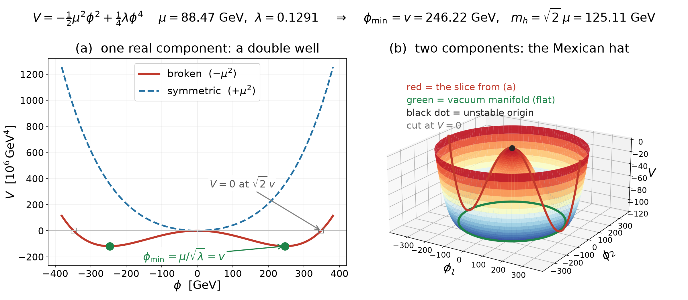

+++
Categories = ["Standard Model"]
bibfile = "mechphys.json"
+++

The **Higgs** field plays a central role in the [[weak]] interaction in the [[Standard Model]], providing a mechanism for converting mathematically _massless_ weak force [[boson]]s into the actual $W^{\pm}$ and $Z^0$ vector bosons that have (large) masses. Furthermore, the Higgs field also gives mass to the [[fermion]]s through _Yukawa_ coupling factors ([[@Yukawa35]]; [wikipedia](https://en.wikipedia.org/wiki/Yukawa_coupling)). Thus, the Higgs is unique in bidirectionally coupling with every other field, and filling the decidedly non-empty vacuum with four values per point that end up giving rise to the mass terms present in all the other fields. This mass term functions like the mass factor in the [[Klein-Gordon]] wave function, both for the Higgs field itself and for the other fields that it couples with, but instead of being a fixed parameter in an equation, it derives from the dynamics of the the Higgs field itself.

At a metaphorical level, the Higgs field sounds sort of like a modern-day version of the [[aether]], in its all-pervasive effects. These effects go well beyond just providing a single scalar mass value, due to the nature of the [[weak#electroweak]] theory that integrates the weak force with the electromagnetic force, where the Higgs field plays a central (and very complex) role ([[@Weinberg67]]; [[@Higgs64]]; [[@EnglertBrout64]]; [[@GuralnikHagenKibble64]]).

The historical development of this whole framework originated because there is no way to accomplish the critical [[conservation]] trick performed by [[gauge theory]] using force-field bosons that have mass ([[@Goldstone61]]; [[@GoldstoneSalamWeinberg62]]). That proved to be a major barrier in trying to understand the weak force, which was known to have a very short range of action, which strongly suggested that it is mediated by massive bosons. Surprisingly, it turns out that by doing all the math with massless bosons, and then adding the mass back in "at the end" in a very particular way, you end up with a sensible mathematical framework. And although this sounds suspiciously like a "hack", it amazingly seems to accurately describe how the electroweak system actually works.

The key mechanism for being able to do the math with massless bosons, and then turning on the mass "at the end", is though the **spontaneous symmetry breaking** in the Higgs field. The Higgs field is driven by the energy of all the other particles in a given region of space, and it also has a separate _self coupling_ factor of a special form known as the **Higgs potential**. If the energy from all the other particles is sufficiently high, it effectively prevents the Higgs potential factor from having an effect, with the consequence that the average (expected) value of the Higgs field amplitudes is zero (as is the case for all the other fields, based on the basic nature of the wave equations).

However, once this background energy level goes below a critical threshold, the effective symmetry of the potential is broken, and the Higgs field takes on a **vacuum expectation value** determined by the Higgs potential, meaning that it now has a consistent effective mass. This threshold energy level is so high that the symmetry was effectively broken within the first 10 picoseconds after the big bang, so the symmetric case is effectively hypothetical for nearly the entire duration of the known universe. But, critically, this symmetric case is where the math all works, and, even though it really doesn't look like it, the exact same math is operating in the post-symmetry breaking era as well.

Specifically, as shown in [[weak#electroweak]], the equations for the pre-symmetry-breaking version are relatively simple and elegant, but the post-symmetry-breaking case introduces significant complexity that only emerges once the Higgs field takes on a consistent expected mass value. It really is the same underlying math, but because the field couplings represent nonlinear interactions, extra terms emerge once the field stabilizes with a consistent mass. Mathematically, the same pre-symmetry-breaking equations are solved with a specific parameterization of this stable mass, which ends up being concentrated entirely in one of the four Higgs field values, as determined by the way these values interact in the electroweak system.

There are two related sources of inspiration for the Higgs mechanism, one from the Landau theory of phase transitions, for example based on the relationship between temperature and ferromagnetism, where at a sufficiently high temperature, the magnetic pole orientations in iron are bouncing around too much to stably align ([[@Melo17]]).

The other major inspiration comes from superconductivity ([[@Goldstone61]]; [[@GoldstoneSalamWeinberg62]]; [[@Nambu60]]; [[@NambuJona-Lasinio61]]; [[@DurrHeisenbergMitterEtAl59]]; [[@Schwinger62]]; [[@Anderson63]]). Superconductors can sustain electrical currents without any resistance ("friction"), and these electrical currents can then give rise to corresponding magnetic fields that cancel out any external magnetic fields inside the superconductor itself. Thus, phenomenologically, this illustrates how a long-range force (magnetism) can become short-ranged like the weak force, when it interacts with an "absorbing" medium. The Higgs field effectively plays this role as the absorbing medium, as a result of obtaining a non-zero mass value.

## Higgs potential

The Higgs mechanism is based on the [[complex KG]] [[Klein-Gordon]] (KG) equation, where the complex values are necessary to have a conserved total magnitude of the state. Although the full version of the Higgs is deeply intertwined with the [[weak]] force, in the full [[weak#electroweak]] system, we can describe a simple version of it here just to illustrate the basic idea of the Higgs symmetry breaking phenomenon.

In this simple case, we can even dispense with the complex state and just use a scalar wave state -- in fact, the electroweak version ends up doing effectively the same thing in order to concentrate all of the mass into one component of the field, while keeping all the rest of the components at zero mass (but the complex version is needed for the [[gauge theory]] logic in coupling with the electromagnetic and weak boson fields).

First, we adopt a standard convention that the effective Higgs field values have a normalization factor applied to them, which is $\frac{1}{\sqrt2}$ for the complex field values, and 1/2 for the scalar $\phi$ values that we're using here.

{id="figure_potential" style="height:25em"}

The general formula for the Higgs potential that shows up in the [[Lagrangian]] as a potential energy factor is written in this form:

{id="eq_higgsv" title="Higgs potential"}
$$
V(\psi) = -\mu^2 \psi^\dagger \psi + \lambda (\psi^\dagger \psi)^2
$$

For our simple scalar example, we define:

$$
\psi = \frac{1}{2} \phi
$$

Such that:

$$
V(\psi) = -\frac{1}{2}\mu^2 \phi^2+ \frac{1}{4}\lambda (\phi^2)^2
$$

The form of this potential is a **mexican hat** shape (cross section in the scalar case) ([[#figure_potential]]), and we can solve for the minima / maxima of it by setting the first derivative of it to 0, to find the points where it is not changing:

$$
\frac{dV(\phi)}{d\phi} = -\mu^2 \phi + \lambda \phi^3
$$

This is 0 when $\phi$ is 0, which ends up being a maximum in the resulting potential, and it also has another 0 point here:

{id="eq_min" title="Minimum point"}
$$
\phi^2 = \frac{\mu^2}{\lambda}
$$

$$
\phi = \frac{\mu}{\sqrt{\lambda}}
$$

This turns out to be the minimum point in the potential, and is where the wave equations will stabilize over time, if nothing else is going on to excite them. In other words, this value defines the _vacuum expectation value_ of the Higgs field.

To incorporate this potential properly into the KG equation, we have to use the [[Lagrangian]] formulation, with the _Euler-Lagrange_ equations that result in the equations of motion for the system. For a field-based system this results in the standard wave equation with an additional term based on the _derivative_ of the potential:

$$
\partial^2 \phi = (\nabla^2 - \frac{dV(\phi)}{d\phi}) \phi 
$$

in effect, the Lagrangian is sensitive to how the potential changes as a function of changes in the wave state, which is intuitively why it shows up as a derivative.

$$
\partial^2 \phi = (\nabla^2 -\mu^2 + \lambda \phi^3) \phi 
$$

As we already showed in [[#eq_min]], these extra terms will be zero when $\phi$ is non-zero, and the wave dynamics will naturally settle into that state over time as a stable equilibrium point, creating the non-zero vacuum expectation value that corresponds to a broken symmetry.

{id="table_params" title="Higgs parameter values"}
| parameter | value |
|---|---|
| $\mu = m_h/\sqrt2$ | 88.47 GeV |
| $\lambda = m_h^2/(2v^2)$ | 0.1291 |
| $\phi_{\min} = \mu/\sqrt\lambda$ | 246.22 GeV $= v$ |
| $m_h = \sqrt2\,\mu = \sqrt{2\lambda}\,v$ | 125.11 GeV |
| $V_{\min} = -\lambda v^4/4$ | $-1.186\times10^8$ GeV⁴ |
| $V = 0$ at $\sqrt2\,v$ | 348.21 GeV |

The actual empirical values for these parameters based on the current data are shown in [[#table_params]] based on the current experimental data ([[@ParticleDataGroup24]]).

## The phase transition

<!--- TODO: add in the T-dependency -->

## Fine tuning / hierarchy problem

Because the Higgs field couples with _all_ [[particle]]s according to the Standard Model, the strength of the Higgs field, i.e., the mass of the Higgs boson, should be a function of the masses of all of the different types of massive particles. Now that the mass of the Higgs boson has been measured, it can be used in reverse to compute the expected masses of all particles, _including any that have yet to be discovered!_ The contribution of any given particle to the Higgs mass is (see [Wikipedia](https://en.wikipedia.org/wiki/Hierarchy_problem)):

{id="eq_mass-delta"}
$$
\Delta m^2_H = - \frac{|\lambda_f|^2}{8 \pi^2} [\Lambda_{\text{UV}}^2 + \dots]
$$

Where $\lambda_f$ is the Yukawa coupling factor, and $\Lambda_{\text{UV}}^2$ is the _ultraviolet cutoff_ energy. Thus, we can use the actual Higgs mass to determine the associated ultraviolet cutoff energy ([[@BezrukovShaposhnikov15]]). The value of $\lambda_f$ can be computed from the Higgs field energy:

$$
\lambda_f = \sqrt{2} m_f / \nu
$$

where $\nu$ is the vacuum expectation of the Higgs field (which depends on the Higgs boson mass), and is equal to 246.22 GeV.

The heaviest currently-known fermion is the top [[quark]], which weighs in at around 172 GeV, which means that its $\lambda_f$ is 1, which is consistent with existing measurements ([[@Collaboration26]]). Thus, using [[#eq_mass-delta]], we can compute that the ultraviolet cutoff implied by this mass is less than $8 \pi$ times the Higgs boson mass, which is 25.12 times 125 GeV = 3,140 GeV. This suggests that the UV cutoff length scale is roughly in the $10^{-20}m$ range, applying this GeV energy to the [[Planck relation]].

This length scale is in the range of the weak force, which operates around the $10^{-18}m$, and is well above the Planck length scale of $10^{-35}m$, where gravitation is as strong as EM. Thus, consistent with the application of the [[renormalization]] procedure, the Higgs mass is consistent with the Standard Model being a _complete_ model, with no room for additional higher-energy (mass) particles, etc.

