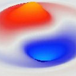

+++
URL = ""
Title = ""
bibfile = "mechphys.json"
+++

**Wave reality** is dedicated to exploring the idea that the quantum wave function is _real_, and not just a description of our state of [[epistemic vs ontic|epistemological]] ignorance. The reality of the wave function is strongly indicated by the classic [[double-slit]] experiment results, where some kind of spatially-distributed wave-like interference phenomenon seems to be influencing the trajectories of discrete particles. The [[pilot-wave]] framework of de Broglie and Bohm ([[@Bohm52]]; [[@Norsen22a]]), which posits a real quantum wave function guiding a discrete particle around, very naturally and intuitively explains all of the otherwise strange phenomena in these and many other classic quantum physics experiments.

This website contains a work-in-progress wiki-like collection of documentation in support of the development of a computational model of the phenomenology of quantum electrodynamics ([[QED]]), starting with the coupled [[Dirac]]-[[Maxwell]] wave functions, along with discrete [[electron]] [[stochastic particles]], consistent with the [[pilot-wave]] framework. This computational model is based on the [[cellular automaton]] framework, which is arguably the simplest way that physics could autonomously emerge in parallel, everywhere in the universe, all at once.

The primary goal of this project is to better understand the basic physics of electrons interacting with the electromagnetic field, and to try to sort through some of the notorious paradoxes and conceptual challenges that lie at the heart of quantum mechanics (QM). There is an easy-to-use GUI-based simulation software package (note: currently under development) that allows one to interactively explore various physics models, providing a concrete and hands-on level of understanding. This provides a different and potentially valuable set of tools for someone trying to learn more about how quantum physics actually works, which may result in quicker and deeper understanding than staring at equations :)

This project is fully committed to **accounting for all the empirical data** --- there is no point in coming up with an elegant theory that is obviously false. We cannot impose our own aesthetic preferences onto Nature, and must humbly accept any irrefutable facts that have been reliably empirically established. However, there is a huge underexplored space of possible physical mechanisms that could account for all the data, while avoiding the kinds of obvious conceptual paradoxes that pervade the standard interpretations of quantum physics.

For example, Einstein famously rejected quantum mechanics because "God does not play dice with the universe" --- that seems just a bit presumptuous. Indeed, a key element of the framework we develop here requires true randomness in the form of [[stochastic particles]], and this one concession of nondeterminism can be traded in to retain several other more important (in my opinion) principles, such as a fundamental **locality** to physical mechanisms.

A critical conceptual foundation of this approach is to recognize the distinction between **calculational tools** versus **physical models** ([[Tools vs models]]). The widespread failure to understand this distinction underlies many of the apparently intractable puzzles in quantum physics, that can be seen as arising from specific choices of calculational tools. There are typically many different ways to calculate a prediction of an experimental result, but presumably Nature is not strategically selecting different calculational tools based on different configurations of elements.

A fundamental assumption here is that Nature must be doing one consistent thing using one set of physical mechanisms, uniformly and consistently across space and time. That thing is what we seek to understand here.

## Waves and particles

From an _ontological_ perspective (i.e., in terms of what we think is _actually real_), there are two seemingly-conflicting entities at the heart of QM: _waves_ and _particles_ (i.e., the "wave-particle duality"). Much of the confusion and paradox in QM is tied up with this duality. The overall approach here follows the [[pilot-wave]] framework in embracing the simultaneous and interacting reality of both particles and waves, and we spend a lot of time and effort understanding the seemingly "magical" properties of [[waves]] in particular.

At one point, I was hopeful that somehow one could do away with particles entirely, given that wave equations can account for so much of the known phenomena in physics, including the mind-bending space-time distortions of special relativity, and the complex dynamics of electricity and magnetism (EM). However, pure waves end up being just a bit too "squishy" and tend to ooze out all over the place. Particles provide a kind of hard "skeleton" that is particularly important for maintaining the strict conservation laws that are so central in physics: Nature is above all a meticulous accountant, it seems. For example, there are strong conservation laws for charge, spin, and particle numbers of various sorts, along with the ubiquitous conservation of total energy.

Furthermore, the [[Pauli exclusion principle]] prevents there from being two of the same _fermions_ (spin 1/2 particles like electrons and quarks) in the same quantum state, which in the pilot-wave framework means being in the same place at the same time with the same spin. This suggests from our computational, [[cellular-automaton]] perspective that there is some kind of underlying constraint like "slots" in a lattice for holding at most one of each type of particle. This is both a welcome simplification for our models of these particles, and a tantalizing suggestion that this computational perspective might provide some unique insights into the underlying nature of the physical world.

This computational perspective also provides an interesting motivation for the need for waves. If you just have a simple discrete point-like particle sitting in some kind of lattice-like grid, it is very difficult to implement realistic force-field interactions among such particles, especially when using other discrete particles like "photons" to mediate these interactions. The purely particle picture of an electron constantly spewing baseball-like photons out in all directions to hit other electrons is very difficult to sustain. How does such a scheme ever achieve any kind of smooth field-like coverage of space using discrete point-like entities? How many balls per femtosecond does it have to spew? How do they manage to spread out uniformly over space and time, while properly conveying the dynamic interactions among the magnetic and electric aspects of the wave functions?

Instead, it is far more straightforward to use [[Maxwell]]'s EM wave equations to model the force field interactions among electrons. However, the ability of a discrete localized electron to "sense" such a force field as a distributed wave remains problematic: EM waves that influence electrons are widely distributed things, and small discrete samples at one point of a wave would not provide the proper net influence that the physical laws require. Thus, it works much better for the electron to also have its own wave field that is directly coupled with the EM wave field.

In effect, the electron's wave field acts like a kind of antenna that senses and responds to the EM forces, and then conveys the results to shape the unfolding trajectory of the discrete particle through space and time, as captured in the pilot-wave model. See [[stochastic particles]] for more details.

One approach is to implement a wave-particle model through coupled [[Dirac]] wave functions for the electron and [[Maxwell]]'s equations for EM, with the Dirac wave providing the guiding [[pilot-wave]] for a discrete electron particle localized within a cubic lattice grid.

The waves in this model are all implemented using the same cubic lattice grid that the discrete electron particles live on, where local neighborhood interactions among the lattice cells implement a highly spatially symmetric form of the _Laplacian_ spatial gradient function at the core of the wave function. In short, the entire model is essentially an elaborate form of [[cellular automaton]] (CA), which has many appealing properties as the simplest-possible framework for a physical system, as advocated by a number of theorists over the years (John Von Neumann; Stanislaw Ulam; [[@Zuse69]]; [[@FredkinToffoli82]]; [[@Fredkin90]]; [[@tHooft05]]; [[@tHooft15]]; [[@Wolfram97]]).

## Quantum non-locality and standard interpretations

One of the primary challenges of this CA framework is reconciling the local interactions among neighboring cells, which so naturally produces a relativistic speed-of-light limit (one time step update per lattice cell), with the now irrefutable evidence for some kind of [[non-locality]] in quantum physics among _entangled_ particles. Recent work within the pilot-wave framework has helped to significantly clarify the nature of these non-local interactions, and the broader conflict that they actually pose for all of QM, despite many attempts to downplay these issues from within the standard QM frameworks ([[@DurrGoldsteinNorsenEtAl14]]).

At the heart of all of this is a fundamental, pervasive confusion of what this non-locality means, where it comes from within the existing QM formalisms, and how it might actually work in a more physically plausible, localist manner.

First, there is a widespread confusion that just because you cannot use quantum non-locality to actually communicate _arbitrary_ information at superliminal (faster than light) speeds ([[@BallentineJarrett87]]), that it does not somehow violate the absolute constraints of [[special relativity]]. This is patently false. The observed non-local correlations across entangled space-like separated particles (i.e., more than the speed-of-light away) absolutely require some form of superliminal physics, or its equivalent in the form of a manifest instantaneous non-locality ([[@Norsen11]]; [[@Maudlin11]]; [[@Shimony93]]).

The inability to use this superliminal transmission for communication is due to the fundamental lack of external control we have over these correlations, which must be analyzed "offline" and in aggregate, in comparison with the results from the other observers, and does not contradict the relativistic violation ([[@Norsen11]]).

In the current framework, the CA models typically require a superliminal update rate to achieve numerical stability, while still propagating light waves at the speed of light. Thus, there is no fundamental requirement that everything in such a framework operate at the the speed-of-light update rate, so it is entirely possible that the quantum wave function is actually communicated significantly faster.

On balance, the adjustment of an arbitrary update rate seems much less consequential than abandoning the foundational requirement of local mechanisms, which are essential for the overall simplicity of the underlying physical system. Non-locality is fundamentally about complexity: what is the scope of communication if not local? How is that determined? What could possibly support the bandwidth necessary for extensive non-local communication? It really just doesn't make any sense at all from a mechanistic perspective.

In this context, a recent paper showed that superliminal _causal_ mechanisms should lead to a violation of the no-signalling constraint ([[@BancalPironioAcinEtAl12]]). However, the analysis there did not take into account the essential role of true randomness (nondeterminism), which is essential ([[@Popescu14]]; [[@AharonovRohrlich08]]). The non-local correlations in quantum physics are much weaker than theoretically possible, reflecting this randomness. Furthermore, other assumptions may yet produce the observed results in a more naturalistic manner ([[@ReidDrummond26]]).

Second, the existing QM formalisms are _all_ based on the use of a [[configuration space]] representation of the physical world, which is manifestly non-local, and thus builds in the non-locality from the start. There is a glaring double-standard where the [[pilot-wave]] framework is dismissed for its reliance on this configuration space representation, while all other standard approaches likewise use precisely the same representation (e.g., in the [[Copenhagen]] interpretation and the [[Hilbert space]] matrix mechanics).

The [[Copenhagen]] interpretation of QM, developed by Niels Bohr and Werner Heisenberg in the 1920's (see [[history]]), is the source of most of the apparent paradoxes and conundrums associated with quantum physics. And yet, it remains the most popular interpretation according to informal surveys of working physicists ([[@Tegmark98]]; [[@SchlosshauerKoflerZeilinger13]]). In the face of the obviously non-physical aspects of this framework, the standard answer is to "shut up and calculate". This is the hallmark of a calculational tool, and as such, it seems prudent to consider this framework as such, and we will not spend any further effort here probing its fundamental strangeness.

The next-most popular interpretation after Copenhagen according those surveys is the _many-worlds_ interpretation originated by [[@^Everett57]], which postulates that the entire universe splits at each measurement event. This nominally avoids the need for wave function collapse, but at what cost? An infinite accumulation of new universes spawning everywhere? This is so completely physically implausible that it just defies belief that so many people could even contemplate such a theory, just because it simplifies the math.

Relatively few / none of the respondents in these surveys endorsed the [[pilot-wave]] approach, despite the fact that it eliminates almost all of the strange paradoxes and counterintuitive ideas advanced in the more widely-accepted interpretations.

The one further step that is really needed for the [[pilot-wave]] framework is to eliminate the [[configuration space]] representation, and derive a fully relativistically compatible, fully local, but likely superliminal, and definitely nondeterministic framework. That is essentially the goal of the present project.

One further, critical point here is that the use of configuration space in existing frameworks has been essential because the underlying equations are _linear_, so configuration space is the only way to capture nonlinear interactions. Linear systems are tremendously advantageous for mathematical analysis, but the computational CA-based approach has no problem incorporating nonlinear dynamics. Therefore, that represents a specific "competitive advantage" of the present approach, in trying to find the right kind of nonlinear dynamics that gives rise to such a simple emergent behavior as captured in the linear configuration-space models.

## Developing the model

Following from the above background (including linked pages above), the following is a suggested sequence of how to proceed through this content:

* [[Contextual]] variables, as contrasted with "real" variables, and their role in understanding the phenomenology of QM.

* [[Semiclassical]] models, that combine a classical treatment of the EM field according to [[Maxwell]]'s equations, with a quantum treatment of the [[electron]]. This is the same approach used in this framework.

* [[QED]] provides an overview of _quantum electrodynamics_ which provides a highly accurate _description_ of the relevant phenomenology of interest. However, we argue that QED is a calculational tool, not a plausible physical model.

* The [[Zero-point]] field and _stochastic electrodynamics_ which provides an alternative formulation of QED, which the present framework shares some important similarities.

* The concept of a luminiferous [[aether]], which was theoretically disproven by the famous Michelson-Morely experiment of 1887, but in fact is entirely consistent with a privileged reference frame as required by the CA framework, as long as that reference frame obeys the critical time / space distortion properties of [[special relativity]] (which of course it must, to be consistent with well-established empirical data).

* [[Waves]] provides the essential foundation for understanding the phenomenology and mathematical formulation of waves, within the CA framework.

* [[Maxwell]]'s equations for the electromagnetic (EM) force field, as a classical field, implemented through CA-based wave functions.

* [[Matter waves]] discusses the general idea of a quantum wave equation that captures something about the properties of massive particles: but what is it actually representing? In the standard QM frameworks, it represents the _epistemic_ probability of finding a discrete particle at a given location at a given point in time. In the [[pilot-wave]] framework adopted here, it represents a physically real wave permeating space, that guides the movement of a discrete particle.

* The [[Klein-Gordon]] (KG) equation provides the simplest version of a relativistically-accurate quantum matter wave function, which can be seen as a kind of second-order version of the much more widely discussed [[Schrodinger]] wave function.

* The [[Dirac]]] wave function builds on the KG equation to capture the phenomenon of _spin_, and provides a physically complete description of the quantum dynamics of a particle like the electron. This is what drives all the amazing predictive accuracy of the [[QED]] framework within the standard model of physics, and is what we hypothesize exists as a real physical wave.

* Finally, the [[electron]] is modeled as a discrete [[stochastic particles|stochastic particle]] that moves with _intrinsic_ (_ontic_) noise under the influence of the Dirac wave function.

