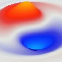

+++
URL = ""
Title = ""
bibfile = "mechphys.json"
+++

**Wave reality** is dedicated to exploring the idea that the **quantum wave function** is _real_, and not just a description of our state of [[epistemic vs ontic|epistemological]] ignorance. The reality of the wave function is strongly indicated by the classic [[double-slit]] experiment results, where some kind of spatially-distributed wave-like interference phenomenon seems to be influencing the trajectories of discrete particles. In addition, there are increasingly strong theoretical and empirical attempts to show that a purely epistemic account contradicts quantum theory ([[@PuseyBarrettRudolph12]], [[@RingbauerDuffusBranciardEtAl15]]).

The relationship between waves and [[particle]]s is the central conundrum in quantum physics, and there have been attempts to resolve these issues by somehow eliminating either the particles or the waves. For example, if you carefully examine the mathematical foundations of quantum physics, you find that there are only waves (or wave-like fields), suggesting that particles can be somehow entirely eliminated ([[@Hobson13]]; [[@Sebens22]]).

However, this idea doesn't take into account the way that [[Standard Model#Feynman diagrams]] introduce discrete particles into the overall mathematical framework of the [[Standard Model]]. These diagrams discretely enumerate _localized_ particle "scattering" interactions, and are an essential ingredient in how the quantum wave equations are actually used to compute empirical predictions, which then account for the many particle-like phenomena that have been reliably established. Furthermore, at a more abstract level, discrete particles are implicit in the _measurement process_ of standard quantum frameworks.

Thus, even though the raw ingredients of quantum theory are wave equations, they are actually _used_ in a way that ultimately describes the behavior of particles. The opposite view, that there are only particles, is even less tenable: as argued above, there are many strong indications that wave phenomena are required (see also [[@Hobson13]]).

The [[pilot-wave]] framework of de Broglie and Bohm ([[@Bohm52]]; [[@Norsen22a]]) instead embraces the **wave-particle** [[duality]] fully, by positing a physically real quantum wave function guiding a discrete particle around. This framework naturally and intuitively explains all of the otherwise paradoxical phenomena in quantum physics. Thus, we adopt this overall framework, and furthermore show that a particular interaction among waves and particles is actually an important _feature_ of how physics must work to "solve" fundamental problems, rather than some kind of paradoxical bug that we just have to somehow learn to swallow.

This website contains a work-in-progress wiki-like collection of documentation in support of the development of a computational model of the phenomenology of the [[Standard Model]] of physics, called the [[Spinfield Model]]. This model captures particle-like properties using a field of complex-valued [[harmonic oscillator]]s (CVHOs) that [[spin]], which interact bidirectionally with quantum waves, such as the [[Dirac]] wave equations for an [[electron]], and the electromagnetic field via the [[Maxwell]] wave functions. The particles move via [[stochastic motion]] driven by velocity values encoded in the phase relationships among the CVHOs.

Phenomenologically, the Spinfield Model is consistent with the [[pilot-wave]] framework, implemented within the constraints of a [[cellular automaton]], which is arguably the simplest way that physics could autonomously emerge in parallel, everywhere in the universe, all at once.

Beyond all the basic quantum phenomena, the nature of [[neutrino]]s and the [[weak]] interactions provide strong constraints and inspiration for the Spinfield Model. For example, the _muon_ is a heavy [[generation]] of an electron, which decays into an electron and two neutrinos, via the weak force. This suggests that the extra mass / energy of the muon is some kind of excited state relative to an electron, and that it can be released in the form of these neutrinos.

There are specific constraints on the conservation of [[lepton]] number and generation, which determine that this extra energy is not released in the form of photons or other particles, further suggesting that the extra mass is somehow more directly tied to the properties of the neutrinos themselves. Neutrinos are the simplest (yet most mysterious) type of particle, consisting esentially of pure [[spin]]. Thus, they are a prime target of the Spinfield Model.

This project is fully committed to **accounting for all the empirical data** that so strongly supports the [[Standard Model]]. There is no point in coming up with an elegant theory that is obviously false. We cannot impose our own aesthetic preferences onto Nature, and must humbly accept any irrefutable facts that have been reliably empirically established. However, there is a huge underexplored space of possible physical mechanisms that could account for all the data, while avoiding the kinds of obvious conceptual paradoxes that pervade the standard interpretations of quantum physics.

For example, Einstein famously rejected quantum mechanics because "God does not play dice with the universe" --- that seems just a bit presumptuous. Indeed, a key element of the framework we develop here requires true randomness in the form of [[stochastic motion]], and this one concession of nondeterminism can be traded in to retain several other more important (in my opinion) principles, such as a fundamental **locality** to physical mechanisms.

A critical conceptual foundation of this approach is to recognize the distinction between **calculational tools** versus **physical models** ([[tools vs models]]). The widespread failure to understand this distinction underlies many of the apparently intractable puzzles in quantum physics, that can be seen as arising from specific choices of calculational tools. There are typically many different ways to calculate a prediction of an experimental result, but presumably Nature is not strategically selecting different calculational tools based on different configurations of elements.

A fundamental assumption here is that Nature must be doing one consistent thing using one set of physical mechanisms, uniformly and consistently across space and time. That thing is what we seek to understand here. See [[interpretations]] for more discussion and links to pages on various interpretations of quantum phenomena and the goal of developing a coherent, sensible physical model of fundamental physics.

## Developing an intuitive, deep understanding of the Standard Model

One major function of the material here is to support the development of an intuitive and deep understanding of the core elements of the [[Standard Model]] of quantum / particle physics. The reader can benefit from this without caring about the mission to develop the [[Spinfield Model]]. The foundation of the Standard Model is a set of wave equations, which can be easily simulated in 3D space within the constraints of the [[cellular automaton]] (CA) framework.

There are a number of [[Simulations]] implemented in an easy-to-use GUI-based tool, which allows one to interactively explore various physics models, providing a concrete and hands-on level of understanding. This provides a different and potentially valuable set of tools for someone trying to learn more about how quantum physics actually works, which may result in quicker and deeper understanding than staring at equations :)

The following sequence of pages develops this understanding of the wave equations up through the [[Dirac]] equation for the [[electron]]:

* [[Conservation]] describes how essentially the entire Standard Model can be seen as a consequence of basic conservation laws: conserving energy, charge, spin, etc. This provides a broad principled framework for understanding how a different mathematical model that exhibits the same conservation properties could thus account for the same data.

* [[Wave]]s are the natural consequence of conservation laws, and this page provides the essential foundation for understanding the phenomenology and mathematical formulation of waves, within the CA framework.

* [[Maxwell]] presents the wave equations for the electromagnetic (EM) force field, as a classical field, implemented through CA-based wave functions. [[Special relativity]] explains this foundational pillar of physics, which can be seen as a natural consequence of the [[wave]] equations.

* The [[Klein-Gordon]] (KG) equation provides the simplest version of a relativistically-accurate quantum matter wave function, which can be seen as a kind of second-order version of the much more widely discussed [[Schrodinger]] wave function.

* In [[complex KG]], we apply the KG wave functions to a complex-valued wave state, which enables a conserved quantity that acts like electrical charge to be computed. Although the [[complex number]]s involved seem mysterious, we see that they are just a mathematical convenience, and we can eliminate them entirely in our second-order wave functions, which are computed using only real-valued numbers. This complex KG system can be directly coupled to [[Maxwell]]'s equations, getting very close to the ultimate goal of capturing all of the properties of an [[electron]].

* Interestingly, this complex KG system provides a good model of the [[Higgs]] field, and the somewhat mysterious phenomenon of _spontaneous symmetry breaking_, which ends up giving mass to all massive particles. Understanding this dynamic is critical for developing the Spinfield Model.

* The final step in the wave function development sequence is the second-order [[Dirac]] wave function, which builds on the complex KG system, and captures the phenomenon of [[spin]]. This then provides a physically complete description of the quantum dynamics of a particle like the electron. This is what drives all the amazing predictive accuracy of the _quantum electrodynamics_ [[QED]] framework within the Standard Model of physics.

