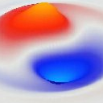

+++
URL = ""
Title = ""
bibfile = "mechphys.json"
+++

**Wave reality** is dedicated to exploring the idea that the **quantum wave function** is _real_, and not just a description of our state of [[epistemic]] ignorance. The reality of the wave function is strongly indicated by the classic [[double-slit]] experiment results, where some kind of spatially-distributed wave-like interference phenomenon seems to be influencing the trajectories of discrete particles. In addition, there are increasingly strong theoretical and empirical attempts to show that a purely epistemic account contradicts quantum theory ([[@PuseyBarrettRudolph12]], [[@RingbauerDuffusBranciardEtAl15]]).

The relationship between waves and [[particle]]s is the central conundrum in quantum physics, and there have been attempts to resolve these issues by somehow eliminating either the particles or the waves. For example, if you carefully examine the mathematical foundations of quantum physics, you find that there are only waves (or wave-like fields), suggesting that particles can be somehow entirely eliminated ([[@Hobson13]]; [[@Sebens22]]).

However, this idea doesn't take into account the way that [[Feynman diagram]]s introduce discrete particles into the overall mathematical framework of the [[Standard Model]]. These diagrams discretely enumerate _localized_ particle scattering interactions, and are an essential ingredient in how the quantum wave equations are actually used to compute empirical predictions, which then account for the many particle-like phenomena that have been reliably established. Furthermore, at a more abstract level, discrete particles are implicit in the _measurement process_ of standard quantum frameworks.

Thus, even though the raw ingredients of quantum theory are wave equations, they are actually _used_ in a way that ultimately describes the behavior of particles. The opposite view, that there are only particles, is even less tenable: as argued above, there are many strong indications that wave phenomena are required (see also [[@Hobson13]]).

The [[pilot-wave]] framework of de Broglie and Bohm ([[@Broglie26]]; [[@Broglie56]]; [[@Bohm52]]; [[@Holland95]]; [[@Norsen22a]]) instead embraces the **wave-particle** [[duality]] fully, by positing physically real [[quantum wave]]s that influence the motion of discrete particles, which always have a well-defined location in 3D space. This framework naturally and intuitively explains many of the otherwise paradoxical phenomena in quantum physics, and it thus provides the foundation for the work here. See [[mechanisms]] for a more detailed overview of how waves and particles can work together to provide a _mostly_ sensible quantum picture.

The overall conclusion is that, contrary to the admonitions of many prominent figures in quantum physics over the years, **a truly surprising amount of quantum physics actually does make sense**. This motivates the attempt to keep going, and see how far we can get! See [[challenges]] for a summary of what remains.

The primary motivation in writing all of this is for the [[author]] to learn by teaching: if I can explain everything clearly to a notional, naive reader, then I feel like I truly understand it myself. You as the reader can thus benefit from all my hard work trying to understand all the complexities of this domain. 

Furthermore, there are nice graphical [[Simulations]] of many fundamental quantum phenomena, which are also an essential part of my learning process: if I can simulate and see what is going on, then I can better understand it. I don't know how everyone else gets by without this kind of aid! You can get by here by just running these simulations and seeing the phenomenology, but of course, to fully understand it, you will need to engage with the underlying math, which is fully presented and explained in a way that at least helped me to understand it. A basic understanding of calculus and basic Newtonian physics is generally assumed, although you can bootstrap yourself from just about anywhere with enough persistence.

Finally, the last part of this effort represents my attempt to come up with a new framework that might make even more sense, based directly on the summary analysis in [[mechanisms]], which provides a high-level integration of the core insights that are explained in detail across the content here. This is very much a work-in-progress, and is continuously updated (you have been warned).

See the [github](https://github.com/WaveReality) repositories for the revision history and released versions of these documents and the associated wave simulation software. This is also the best place to contribute, by filing issues or starting discussions (all such input is welcome!).

## Organization

There are three major threads of content, organized under the following categories.

### Standard Model

[[Standard Model]] provides an in-depth description of the currently-accepted understanding of fundamental physics, which is made particularly concrete and accessible through the use of computational [[Simulations]] with intuitive, dynamic graphical renderings of the various kinds of [[wave]] functions that provide the foundation for this model, including the [[complex waves]] based on [[complex number]]s. These waves include the [[Klein-Gordon]], [[Schrodinger]], [[Maxwell]], [[Dirac]], and [[Weyl]] equations. As the product of a non-physicist author, the presentation leans heavily into developing an intuitive conceptual-level understanding, with most of the math supported by the computational models that bring the equations to life.

The treatment is essentially taking a _classical_ approach to the quantum world of waves ([[@Rubakov09a]]), which provides insight into the foundational components upon which the [[field theory]] model builds. In other words, the simulations give you a physical, qualitative feeling for what these different wave functions do, but they only simulate single particles at any given point in time.

Once you understand how all the different individual wave equations work within each of their own distinct types of wave states, the next major question is: how do these wave equations interact with each other to simulate a [[particle]] interacting with a force field, for example the [[electron]] interacting with the electromagnetic [[Maxwell]] force field, as in the [[QED]] framework? Amazingly, there is only one way to formulate this interaction mathematically, that results in the [[conservation]] of energy and overall electrical charge, which is [[gauge theory]]. This is therefore a foundational framework for the Standard Model, and for any attempt to understand how waves work in quantum physics.

The crowning achievement for our treatment of the Standard Model, and a "triumph" of gauge theory, is the [[weak#electroweak]] system, with the [[Higgs]] field (basically Klein-Gordon) interacting with no less than four copies of the [[Maxwell]] electromagnetic potential fields (i.e., the _gauge_ fields) and the Weyl fields for the electron / neutrino. The inevitable logic of gauge theory essentially determines the solution to the central puzzle in the [[weak]] force: how can you have force fields with mass, when gauge theory explicitly prevents them? We provide a full classical simulation of the result, so you can see everything unfolding right there on your computer!

This project is fully committed to **accounting for all the empirical data** that so strongly supports the Standard Model. There is no point in coming up with an elegant theory that is obviously false. We cannot impose our own aesthetic preferences onto Nature, and must humbly accept any irrefutable facts that have been reliably empirically established. However, there remains a huge underexplored space of possible physical mechanisms that could potentially account for all the data, and at least one can learn a lot by trying, no matter how daunting that might sound!

### Interpretations

[[Interpretations]] provides a discussion of various alternative attempts to understand the quantum realm. The most important point here is to clearly recognize the distinction between [[calculational tool]]s versus **physical models**. Although this distinction is recognized by some people in some domains, it still seems that many of the fundamental confusions that persist are based on trying to interpret the potential physical reality of something that should otherwise be seen as a purely calculational tool. 

There are typically many different ways to calculate a prediction of an experimental result, but some of them involve what seem like obvious mathematical shortcuts or simplifications, for example the explicit use of $1/r^2$ in the Coulomb electric force law or Newton's theory of gravity. This would imply some kind of _action at a distance_, which indeed was a major source of consternation in the case of Newton's law. However, there are well-established alternatives to each of these laws that avoid this action-at-a-distance formulation, while describing the exact same underlying physics. Clearly, any attempt to provide a physical interpretation of what Nature is actually doing should be focused on these more plausible alternatives.

A significant challenge in applying this logic to the quantum realm is that, from the very start of this field, there have been strong and systematic arguments from the major authorities, that **the quantum world is entirely beyond our abilities to understand**. For example, Richard Feynman said that "I think I can safely say that nobody understands quantum mechanics", while the [[Copenhagen]] interpretation specifically denies the existence of physical reality outside the process of measurement, and leaves the definition of what constitutes a measurement entirely unspecified. In general, the mantra is "shut up and calculate", which is clearly consistent with the use of calculational tools.

Despite these admonitions to the contrary, there is a large literature that has attempted to provide some kind of physical-level understanding of the quantum world. However, this literature has often tried to interpret the physical reality of constructs that otherwise have strong indications of being a calculational tool. Most importantly, such tools typically involve non-local parameters that provide a convenient representation of a specific problem, but which therefore do not provide a [[universal basis]] representation.

The universal basis representation defines an abstract, computational-level system that can be used to solve _any_ given physics problem using a consistent, strictly-bounded set of calculations and representations. This provides a concrete basis for distinguishing calculational tools from candidate physical models, which avoids applying potentially naive physical intuitions from macroscopic physics. Furthermore, it converges with the [[cellular automaton]] (CA) approach, which is foundational to the perspective adopted here.

The multiple different formulations of quantum physics that differ in their physical implications (e.g., Copenhagen vs. pilot-wave) provide another salient example that there is indeed a space of different models that really differ in qualitative ways about their underlying ontology, which have significant implications for how we interpret what Nature might actually be doing. Therefore, we can carefully develop an understanding that avoids focusing on computational tools, while trying to identify the hard constraints that can be extracted from the existing formulations. Exploring that space, in search of the universal basis representation for the Standard Model, is the main goal of this set of content.
    
As a starting point, it is essential to recognize the differences between the most abstract, "old" formulation of quantum mechanics in terms of the [[Hilbert space]] evolving in a unitary fashion according to the [[Schrodinger]] wave function, and the actual complexities of the Standard Model. Most interpretations are restricted to the abstract formulation, which must be seen as a highly-simplified calculational tool even in relation to the known properties of the Standard Model.
    
The approach taken here is guided by an attempt to build bridges between two opposing levels of analysis. From the top-down, the two thorniest, interrelated issues are the [[non-locality]] observed between entangled particles in the widely-discussed [[Bell]] tests, and the exponentially-large [[configuration space]] needed to represent these non-local correlations in the abstract models. From the bottom-up, we build up from the CA framework, which is arguably the simplest way that physics could autonomously emerge in parallel, everywhere in the universe, all at once.

Is there any way to reconcile the seemingly-incompatible constraints across these two levels? The approach here is to adopt a pragmatic kind of "triage": exponential explosion and non-locality are _such_ intractable barriers to a universal basis representation, and thus a viable physical model within the CA framework, that, by comparison, having _some_ superluminal elements in the system is relatively much more tractable. In addition, fundamentally stochastic, non-deterministic behavior is also a relatively easy pill to swallow in comparison.

Have these levers, within the broader context of the pilot-wave framework where potentially superluminal quantum waves are constantly interconnecting discrete particles and driving interference and amplification between them, been sufficiently explored and ruled out? Are there other indications that the configuration space tool is fundamentally inaccurate from a physical model perspective (e.g., in its well-established conflict with [[special relativity]])? These are some of the central questions that seem insufficiently explored to date.

### Spinfield Model

The [[Spinfield Model]] is the work-in-progress attempt to develop a fully explicit functional computational-level model of the phenomenology of the Standard Model, within the CA and pilot-wave framework, motivated by an attempt to understand the qualitative nature of the wave and particle [[mechanisms]] in the quantum world. This model captures particle-like properties using a field of complex-valued [[harmonic oscillator]]s (CVHOs) that [[spin]], which interact bidirectionally with [[quantum wave]]s, such as the [[Weyl]] wave equations for an [[electron]], and via the electromagnetic field as described by the [[Maxwell]] wave functions. The particles move via [[stochastic motion]] driven by velocity values encoded in the phase relationships among the CVHOs.

Beyond all the basic quantum phenomena, the nature of [[neutrino]]s and the [[weak]] interactions provide strong constraints and inspiration for the Spinfield Model. For example, the _muon_ is a heavy [[generation]] of an electron, which decays into an electron and two neutrinos, via the weak force. This suggests that the extra mass / energy of the muon is some kind of excited state relative to an electron, and that it can be released in the form of these neutrinos.

There are specific constraints on the conservation of [[lepton]] number and generation, which determine that this extra energy is not released in the form of photons or other particles, further suggesting that the extra mass is somehow more directly tied to the properties of the neutrinos themselves. Neutrinos are the simplest (yet most mysterious) type of particle, consisting essentially of pure [[spin]]. Thus, they are a prime target of the Spinfield Model.

