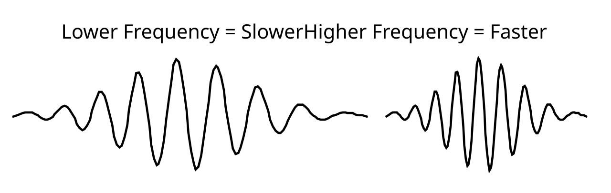

+++
Categories = ["Standard Model"]
Name = "Klein-Gordon"
bibfile = "mechphys.json"
+++

The **Klein-Gordon** (KG) wave function is the simplest version of a [[wave]] equation that captures the known physics of particles such as an [[electron]]. In fact, it explains a surprisingly wide range of physical phenomena, including Newtonian and relativistic equations of motion, the Lorentz transformations of [[special relativity]], and the quantum mechanical relationship between wave frequency and velocity (momentum), all with an incredibly simple equation.

The KG wave function can be derived directly from Einstein's relativistic definition of total energy, via the [[Hamiltonian]] strategy. After reading this chapter, which covers the phenomenology of the KG wave equation, it is recommended to read that derivation to obtain a deeper understanding of why and how the KG equations account for all of special relativity.

The incredible scope of phenomena accounted for by the simple KG equation makes it tempting to think that particles are actually [[matter waves]], in the form of a spatially-localized _wave packet_. However, despite all the amazing properties of the KG equation (and its more complicated iteration in the [[Dirac]] wave function), these matter waves have a fatal flaw: they inevitably diffuse away into amorphous blobs that fail to account for the precise localization of particles like electrons.

If you were to imagine something like an electron to actually be a matter wave, then it becomes very difficult to understand how all of the widely distributed, far-flung bits could be somehow gathered up and accounted for, in order to satisfy strict conservation laws. Every time an electron is measured it has the exact same charge. And rest mass. This extremely difficult to imagine happening when you see what happens to the KG waves over time.

In fact, it is precisely as implausible as the standard [[Copenhagen]] interpretation of QM, which requires the complete collapse of far-flung wave equations, which are thought to determine the probability of particle properties being measured in any given location.

Nevertheless, there is much to learn about physics and wave functions by understanding the almost miraculous properties of the KG wave function.

Recall that the wave equation can be written as a second-order differential equation:

{id="eq_wave" title="standard wave equation"}
$$
\frac{\partial^2 {\varphi}}{\partial t^2} = c^2 \nabla^2 \varphi
$$

{id="figure_mass" style="height:20em"}

What if we add a single new term to this equation, where we subtract away some *mass* ($m_0$, a constant) from the Laplacian ($\nabla^2 \varphi$) curvature driving force term ([[#figure_mass]]):

{id="eq_mass" title="mass subtraction"}
$$
\frac{\partial^2 {\varphi}}{\partial t^2} = c^2 \left( \nabla^2 \varphi - \frac{m_0^2}{\hbar^2} \varphi \right)
$$

or, in somewhat simpler notation that we'll use more frequently:

{id="eq_kg" title="Klein-Gordon equation"}
$$
\frac{\partial^2 {\varphi}}{\partial t^2} = c^2 \left(\nabla^2 - \frac{m_0^2}{\hbar^2} \right) \varphi
$$

where "hbar" $\hbar = \frac{h}{2\pi}$ and $h$ is Planck's constant.

The most natural interpretation of Planck's constant here is as a scaling term on the impact of mass on the matter wave dynamics. For this reason, it is puzzling how _h_ could possibly show up in light waves, because they have no mass, and there is no role for this constant in [[Maxwell]]'s EM wave equations. Thus, one could view Einstein's creation of the photon with energy $E = h \nu$ as a calculational [[tools-vs-models|tool]] for representing the interaction between EM waves and matter in atomic systems, and it is the matter waves that impart the _h_ constant, not the EM "photon". See [[semiclassical]] for more discussion.

In any case, this new equation ([[#eq_kg]]) is called the **Klein-Gordon (KG)** equation, named after Oskar Klein and Walter Gordon, who published the first papers on it ([[@Klein26]]; [[@Gordon27]]; see [[@Kragh84]] for a detailed history of this equation, which was actually discovered by many individuals, including Schrödinger). This equation captures a surprising number of important phenomena, as we detail next.

First, we'll introduce some variations on how to write this equation, which are all obviously identical to the KG equation given above, but highlight different features of it, as we'll see more later. Here's one such variation:

$$
\frac{\partial^2 {\varphi}}{\partial t^2} - c^2 \nabla^2\varphi = -\frac{c^2 m_0^2}{\hbar^2} \varphi
$$

and another:

$$
\left(\frac{\partial^2 {}}{\partial t^2} - c^2 \nabla^2 + \frac{c^2 m_0^2}{\hbar^2}\right) \varphi = 0
$$

These last two forms are useful for relating to the [[four-vector]] version of the wave equation, where we saw that:

$$
\partial_\mu \partial^\mu = \frac{\partial^2}{\partial t^2} - c^2 \nabla^2
$$

so that the equation can be written:

{id="eq_kg-4vec" title="Klein-Gordon four-vector"}
$$
\partial_\mu \partial^\mu \varphi = - \frac{c^2 m_0^2}{\hbar^2} \varphi
$$

or:

$$
\left(\partial_\mu \partial^\mu + \frac{c^2 m_0^2}{\hbar^2}\right) \varphi = 0
$$

To actually implement this KG equation in our cellular automaton model, we make one modification to the acceleration term, to subtract off the mass:

{id="eq_disc" title="discrete Klein-Gordon equation"}
$$
\ddot \varphi_i^{t+1} = c^2 \frac{3}{13}\sum_{j \in N_{26}} k_j (\varphi_j - \varphi_i) - \frac{c^2 m_0^2}{\hbar^2} \varphi_i
$$

## Variable speeds: momentum from frequency

{id="figure_frequency" style="height:20em"}

One of the most important features of this KG equation is that waves now travel at _variable speeds_, instead of always moving at exactly the same speed (the speed of light). This speed now depends on the relationship between the curvature ($\nabla^2 \varphi$) and the squared-mass value $\frac{m_0^2}{\hbar^2} \varphi$. In essence, the mass "drags down" the wave propagation force conveyed by the local curvature, $\nabla^2 \varphi$. Therefore, to get the wave to move faster, you need more curvature, which is to say, a higher frequency wave, because higher frequency waves have more waves per unit length, and this means overall greater "curvature" ([[#figure_frequency]]).

This relationship between frequency $f$ of a wave and the momentum (velocity * mass) of the particle that it describes is captured in one of the most basic equations of quantum physics:

$$
p = \frac{h}{c} f
$$

where $p$ is the momentum, and $h$ is Planck's constant. This can also be written in terms of the wavelength $\lambda$, which is the inverse of the frequency:

$$
f = \frac{c}{\lambda}
$$

$$
\lambda = \frac{c}{f}
$$

$$
\lambda f = c
$$

so that momentum is inversely proportional to the length of the waves:

$$
p = \frac{h}{\lambda}
$$

Although it might be tempting to compute the velocity from the momentum expression given above (e.g., $p = m v$ so $v = \frac{p}{m}$), this is not accurate due to the effects of special relativity as we discuss in greater detail below. Instead, the appropriate equation that relates the momentum and the velocity is:

{id="eq_" title="relativistic momentum-velocity relationship"}
$$
p = \gamma m_0 v
$$

where $\gamma$ is the Lorentz factor as described in [[special relativity]]. When we make all the necessary substitutions and do a bit of algebra, we end up with this expression for the velocity of the "particle" as a function of wavelength, rest mass, and the relevant constants:

{id="eq_" title="velocity as function of wavelength, relativistically correct"}
$$
v = \frac{h c}{\sqrt{c^2 m_0^2 \lambda^2 + h^2}}
$$

See [[special-relativity#relativistic momentum and velocity]] in [[special-relativity]] for all the algebraic steps in this derivation. In the exploration below we'll confirm this equation experimentally. The complexity of this equation for velocity versus the much simpler expressions for momentum indicate why momentum and not velocity is the natural quantity to deal with in relativistic wave functions.

Also, as we will explore in greater detail later, the momentum can be computed directly from the wave function in terms of the first-order spatial derivative or gradient:

{id="eq_" title="essence of momentum operator"}
$$
\vec{p} \propto \vec{\nabla} \varphi
$$

where this spatial gradient is again going to be greater overall as the wave frequency increases, as suggested by the quantum mechanical relationships above.

Again, the main point for now is just that introducing the mass term makes the relative curvature or frequency of the wave matter in determining the overall velocity or momentum of the wave packet that describes a particle. Without this mass term, all waves travel at the speed of light.

## Newtonian mechanics: F = ma

We can intuitively see that this very simple modification to the wave equation captures all of classical (Newtonian) mechanics for a "particle" characterized by a wave according to this equation. In the absence of any external forces, the wave will propagate along at a constant velocity (Newton's first law of inertia), because the frequency of the wave does not decrease (and it would not change its overall direction of propagation). If a force is applied to this system, it will change the frequency of the oscillation of the wave, and thus result in a change in momentum, in accord with Newton's second law:

$$
F = \frac{\partial \vec{p}}{\partial t} = m \frac{\partial \vec{v}}{\partial t} = m \vec{a}
$$

After a few more developments, we can make this relationship much more formally accurate and precise, by considering the overall energy and momentum relationships computed by the KG wave equation. We will see that Schrödinger's equation, which is the primary wave equation for basic quantum physics, captures classical Newtonian physics, and that the KG equation is a version of Schrödinger's equation that also takes into account special relativity, which is important when particles are moving very fast (i.e., relatively close to the speed of light).

Anticipating these results, and relying on intuition for now, we see that with one tiny addition, we now have an equation that can describe the motion of a massive particle through space (e.g., as a wave packet), in agreement with all the known physical laws (i.e., quantum physics and special relativity, which reduce in certain cases to the more familiar Newtonian mechanics).

## What is the mass?

The value $m_0$ in the KG equation is the **rest mass** of the particle that it describes (the 0 subscript indicates "rest"). It is a fixed, constant value for a given type of particle, e.g., $9.1x10^{-31}$ kg for an [[electron]], which is an extremely tiny amount of mass.

The value of $m_0$ also defines the **Compton wavelength** of a given particle, which is the wavelength of a particle at rest, due strictly to the rest mass. The formula for the Compton wavelength $\lambda_C$ is:

$$
\lambda_C = \frac{h}{m_0 c}
$$

Interestingly, consider what happens when you set the rest mass of our particle to zero: that extra termm in the KG equation drops out, and you recover the basic wave equation from before. Thus, it is immediately obvious that "particles" with a zero rest mass must move at the speed of light. This is a basic postulate of special relativity. Note also that it is impossible for a massive particle to travel at the speed of light, because it would have to have an infinitely high frequency, and this is not possible (even in a continuous spatial model).

One potential challenge with the KG equation is that this rest mass parameter must be "baked in" to the wave function equations. What if we are simulating different types of particles, beyond just electrons? For example, the [[leptons]] class includes the much more massive _muon_ and _tau_ particles, which are otherwise identical to the electron. It seems rather inelegant to have to have different wave functions for each of these different types of particles, each with their own rest mass parameter.

Indeed, the [[stochastic motion]] framework attempts to solve this problem by associating the rest mass with the internal dynamics of the particle: rest mass is just the energy associated with the internal gyrations of particles when they are not otherwise moving anywhere. This provides a much more elegant and natural explanation for the rest mass, and suggests that the [[matter waves]] approach may not be correct.

## Smooth, continuous motion

As a continuous-valued second-order wave equation, the KG equation still has all of the advantages discussed earlier about making the underlying grid disappear. Furthermore, it easily and naturally allows us to describe continuously variable rates of speed, in terms of continuous variation in the frequency or wavelength of wave oscillation. Particles described by such an equation can also travel in any direction, because of the essentially perfect spatial symmetry of wave propagation exhibited by this equation.

In contrast, models with a discrete particle suffer from all manner of complexity in overcoming such problems. Thus, by describing a particle exclusively using this wave equation, we avoid many difficulties, and it remains to be seen if we encounter any other problems.

## Exploration of Klein-Gordon waves

Now we explore the above properties of the Klein-Gordon wave equation, to get a concrete sense of how it works, before turning to a more extended discussion of how the KG wave equation explains the stretchy properties of matter implied by the Lorentz transformation and special relativity.

See [[KG 1D Simulation]] for the 1D version, and [[KG 3D Simulation]] for the 3D.

## Initial conditions

Creating a moving wave packet that moves with a given velocity is a bit more complicated than for the simple wave equation, because we have more constraints to take into account.

## Schrödinger's equation vs Klein-Gordon

The Klein-Gordon equation that we've been exploring is typically introduced as a strange and problematic alternative to the Schrödinger wave equation, which provides the cornerstone of standard quantum physics, even to this day. In [[Hamiltonian]] (recommended as next reading), you can see how the KG equation can be derived from the relativistic total energy. By contrast, Schrödinger's equation can be derived from _Newtonian_ total energy, and therefore it fails to account for the phenomena of [[special relativity]].

The fact that Schrödinger's equation remains the predominant tool used by practicing physicists can be attributed to its strict conservation properties, where the total probability value (computed as the complex conjugate of the wave values), is conserved as it propagates through space. In contrast, the KG equation does not have such a strict conservation behavior.

Furthermore, the Schrödinger equation is a first-order wave equation, which has many advantages from an analytical perspective, even as it makes it very difficult for many people to understand, due to its reliance on [[complex number]]s. In general, wave-like behavior can either be described by a second-order equation involving normal scalar variables (as we've been doing), or it can be described by a first-order equation involving complex numbers, exemplified by the Schrödinger equation.

In the first-order version, you have two variables for every one variable in the second-order one --- we'll see later that this fact allows us to use only four variables to represent an electron using a second-order wave equation, whereas the standard first-order Dirac equation requires eight. The general intuition is that a first-order wave equation involves motion as rotation among its complex variables, in addition to motion through space, whereas the second-order equation just has motion through space.

See [[Schrodinger]] for the full derivation, and exploration of its properties.

For the next step, move on to [[complex KG]] for the application of the KG function to the two elements of a complex number, which opens up a major new set of phenomena in the interaction with the electromagnetic field.

